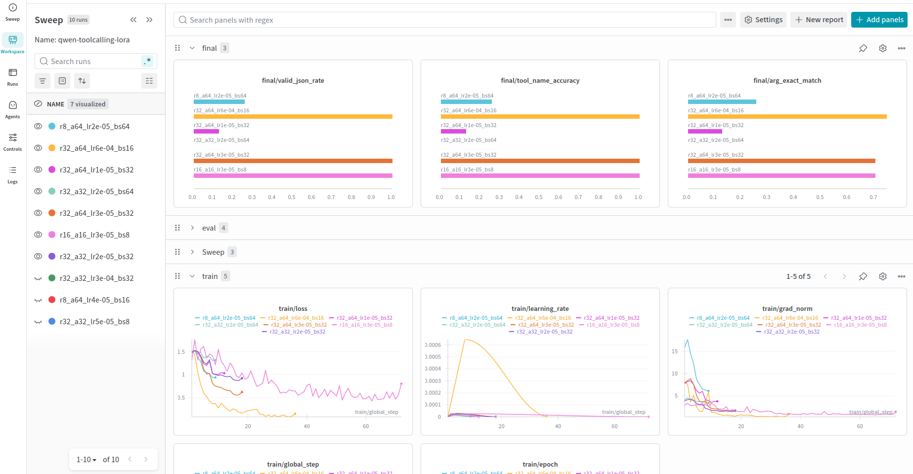

# Fine-Tuning LLMs for Tool Calling

A framework for fine-tuning Large Language Models to generate structured tool calls using [Unsloth](https://github.com/unslothai/unsloth) and LoRA. It integrates with Weights & Biases for hyperparameter sweeps and experiment tracking.

## Overview

The goal is to train small LLMs that can:

1. Understand natural language commands (possibly multilingual).
2. Select the appropriate tool to invoke.
3. Generate correctly formatted tool calls with precise arguments.

The framework is domain-agnostic. Current datasets include **domotic control** (lights, blinds, devices, modes) and **Behavior Tree execution** for robotics, but any tool-calling schema can be used.

Example output (Qwen3 format):

```xml
<tool_call>
{"name": "lights_control", "arguments": {"room": "kitchen", "action": "on"}}
</tool_call>
```

## Project Structure

```
fine_tuning_bt_tools/
├── adapters/                # Saved LoRA adapters (and optional GGUF exports)
├── checkpoints/             # Intermediate training checkpoints (auto-cleaned)
├── configs/
│   └── sweep_config.yaml   # W&B sweep hyperparameter search space
├── data/
├── doc/
├── notebooks/
│   └── try_adapters.ipynb   # Interactive adapter testing
├── templates/               # Chat templates for different models
└── training/
    ├── fine_tuning.py       # Main training script (W&B sweep integration)
    ├── data_loader.py       # Dataset tokenization and collation
    ├── eval.py              # Tool-calling evaluation metrics
    └── .env.example         # Environment variable template
```

## Installation

### Using uv (recommended)

```bash
curl -LsSf https://astral.sh/uv/install.sh | sh
uv sync

# With Jupyter / notebook support
uv sync --extra dev
```

### Using pip

```bash
pip install -r requirements.txt
```

### Environment Setup

```bash
cp training/.env.example training/.env
```

Edit `training/.env`:

```
HF_TOKEN=your_hugging_face_token_here
WANDB_ENTITY=your_wandb_entity_here
WANDB_PROJECT=your_wandb_project_here
```

## Data Format

Training data uses the ChatML conversation format. Each example contains a system prompt, a user request, an assistant tool call, and a tool response:

```json
{
  "train": [
    {
      "messages": [
        { "role": "system", "content": "You are a home assistant." },
        { "role": "user", "content": "Turn on the kitchen light." },
        {
          "role": "assistant",
          "content": "",
          "tool_calls": [
            {
              "name": "lights_control",
              "arguments": { "room": "kitchen", "action": "on" }
            }
          ]
        },
        { "role": "tool", "content": "Light turned on in kitchen." },
        { "role": "assistant", "content": "Done, the kitchen light is now on." }
      ]
    }
  ]
}
```

Tool schemas are defined in a separate JSON file following the standard function-calling format:

```json
[
  {
    "type": "function",
    "function": {
      "name": "lights_control",
      "description": "Controls the lights in a specified room.\nInput: room (string), action (string: on/off)"
    }
  }
]
```

## Hyperparameter hard coded in `fine_tuning.py`:
| Parameter | Description |
|-----------|-------------|
| `model_id` | The base model to fine-tune (e.g., "Qwen/Qwen3-0.6B"). |
| `model_type` | The type of the base model (e.g., "qwen3" or "functiongemma") must be the same name as the model's jinja template. |
| `tools` | Path to the tool schema JSON file. |
| `system_prompt_path` | Path to the system prompt file if set to none the default system prompt in dataset is used. |
| `json_path` | Path to the dataset JSON file (ChatML format). |
| `threshold` | Early stopping threshold for evaluation loss improvement (default: 0.05 for 5%). |
| `patience` | Early stopping patience in number of evaluations (default: 2). |
| `eval_loss_threshold` | Maximum evaluation loss threshold allowed for evaluating and saving the model (should be set based on your desired performance). |
|`max_seq_length / max_length` | Maximum sequence length for training and evaluation. Default is 1024, if too short, longer sequences are truncated, but if too long, it may cause out-of-memory errors. |

## Sweep Configuration

The sweep config (`configs/sweep_config.yaml`) defines the hyperparameter search space:

```yaml
program: fine_tuning.py
method: random          # bayes, random, or grid
metric:
  name: eval/loss
  goal: minimize

name: qwen3-toolcalling-lora

parameters:
  learning_rate:
    distribution: log_uniform_values
    min: 1e-4
    max: 1e-3

  lora_r:
    values: [8, 16, 32]

  lora_alpha:
    values: [16, 32, 64]

  num_train_epochs:
    values: [1, 2, 3]

  gradient_accumulation_steps:
    values: [8, 16, 32]

  max_batch_size:
    value: 32

  lora_dropout:
    distribution: uniform
    min: 0.05
    max: 0.15

  warmup_ratio:
    values: [0.05, 0.1, 0.15]

  export_to_q8:
    value: true
  export_to_q4:
    value: false
```

### Parameter Reference

| Parameter | Description |
|-----------|-------------|
| `learning_rate` | Optimizer learning rate. Searched in log-uniform scale. |
| `lora_r` | LoRA rank. Higher values increase capacity but also memory usage. |
| `lora_alpha` | LoRA scaling factor. Commonly set to 1--2x `lora_r`. |
| `num_train_epochs` | Number of full passes over the training set. |
| `gradient_accumulation_steps` | **Effective batch size.** The total number of samples whose gradients are accumulated before a weight update. |
| `max_batch_size` | Maximum micro-batch size that fits in GPU memory. The trainer computes `per_device_train_batch_size` and the actual accumulation steps from these two values. |
| `lora_dropout` | Dropout probability applied to LoRA layers. |
| `warmup_ratio` | Fraction of total training steps used for learning rate warmup. |
| `export_to_q8` | Export the best adapter to GGUF Q8_0 format after training. |
| `export_to_q4` | Export the best adapter to GGUF Q4_K_M format after training. |

### Understanding `max_batch_size` and `gradient_accumulation_steps`

The `gradient_accumulation_steps` parameter in the sweep config represents the **desired effective batch size**, not the raw number of accumulation steps. The training script divides this value by `max_batch_size` to compute the actual per-device batch size and gradient accumulation steps:

```
effective_batch_size = gradient_accumulation_steps  (from config)
per_device_batch_size = min(effective_batch_size, max_batch_size)
actual_accumulation  = effective_batch_size / per_device_batch_size
```

Setting `max_batch_size` correctly is critical: it should be the largest micro-batch your GPU can handle without running out of memory. A value too low wastes throughput; a value too high causes OOM errors. The effective batch size remains the same regardless of `max_batch_size` -- only training speed changes.

## Training

### W&B Sweeps

```bash
# Create a sweep
cd training
wandb sweep ../configs/sweep_config.yaml

# Start an agent (the output provides the sweep ID)
wandb agent <entity>/<project>/<sweep_id>

# Run multiple agents in parallel (separate terminals)
wandb agent <entity>/<project>/<sweep_id> --count 5
```

### Model Loading with Unsloth

The training script loads models through Unsloth's `FastLanguageModel`, which provides optimized kernels and memory-efficient LoRA patching:

```python
model, processor = FastLanguageModel.from_pretrained(
    model_name="Qwen/Qwen3-0.6B",
    max_seq_length=1024,
    dtype=torch.bfloat16,
    load_in_4bit=False,
    load_in_8bit=False,
    load_in_16bit=True,
)
```

Quantized loading is available via `load_in_4bit` or `load_in_8bit` flags to reduce memory usage during training.

### LoRA Configuration

LoRA adapters target attention and MLP projection layers:

```python
model = FastLanguageModel.get_peft_model(
    model,
    r=16,
    lora_alpha=32,
    lora_dropout=0.05,
    target_modules=["q_proj", "k_proj", "v_proj", "o_proj",
                    "gate_proj", "up_proj", "down_proj"],
)
```

### Training Callbacks

- **Early stopping**: Training halts if eval loss does not improve by a configurable threshold for a set number of evaluations (default: patience=2, threshold=5%).
- **Checkpoint cleanup**: Intermediate checkpoints are deleted after training to save disk space. Only the best adapter is kept.

### Training Output

After each run the following are saved:

- **Best adapter**: `adapters/{model_type}_{run_name}_best/`
- **GGUF exports** (optional): saved alongside the adapter when `export_to_q8` or `export_to_q4` are enabled.

Run naming convention: `ep{epochs}_r{lora_r}_a{lora_alpha}_lr{learning_rate}_bs{effective_batch_size}`

## GGUF Export

Unsloth handles GGUF conversion directly -- no separate merge or conversion step is needed. After training, the best adapter can be exported to GGUF format in-place:

```python
model.save_pretrained_gguf(
    output_path,
    processor,
    quantization_method="q8_0",   # Options: q4_k_m, q8_0, f16
)
```

This is controlled by the `export_to_q8` and `export_to_q4` sweep parameters. Both can be enabled simultaneously to produce multiple quantized variants. The exported GGUF files are saved alongside the LoRA adapter in the `adapters/` directory and are ready for use with llama.cpp or Ollama.

## Evaluation Metrics

The evaluation module (`training/eval.py`) runs inference on held-out data and computes:

| Metric | Description |
|--------|-------------|
| `tool_name_acc` | Fraction of predictions with the correct tool name. |
| `arg_exact` | Fraction of predictions with exactly matching arguments. |
| `valid_json` | Fraction of predictions that produce valid JSON arguments. |
| `generated_tool_calls_ratio` | Ratio of generated tool calls to expected tool calls. |

Results are logged to W&B under the `final/` prefix.

## Using Trained Adapters

The notebook `notebooks/try_adapters.ipynb` provides interactive testing of trained adapters: load a base model, apply the LoRA weights, run inference on test prompts, and compare against expected outputs.

## W&B Sweep Results



## Adding a New Domain

1. Create a tool schema JSON file in `data/` following the function-calling format.
2. Create a training dataset JSON file with ChatML conversations that exercise those tools.
3. Write a system prompt template (plain text or Jinja) in `data/`.
4. If needed, add a Jinja chat template under `templates/` for the target model family.
5. Update the file paths in `fine_tuning.py` (or `train_no_wandb.py`) and run a sweep.

